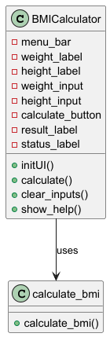

# BMI Calculator

A simple BMI calculator using PyQt6 to determine BMI and categorize weight status.

## Features
- User-friendly UI
- Input fields for weight (kg) and height (cm)
- Calculates BMI and displays the corresponding weight category
- Menu options: Exit, Clear, Help

Example
Input: Weight: 80 kg, Height: 190 cm
Output: BMI: 22.2, Status: Normal weight

## Diagram

